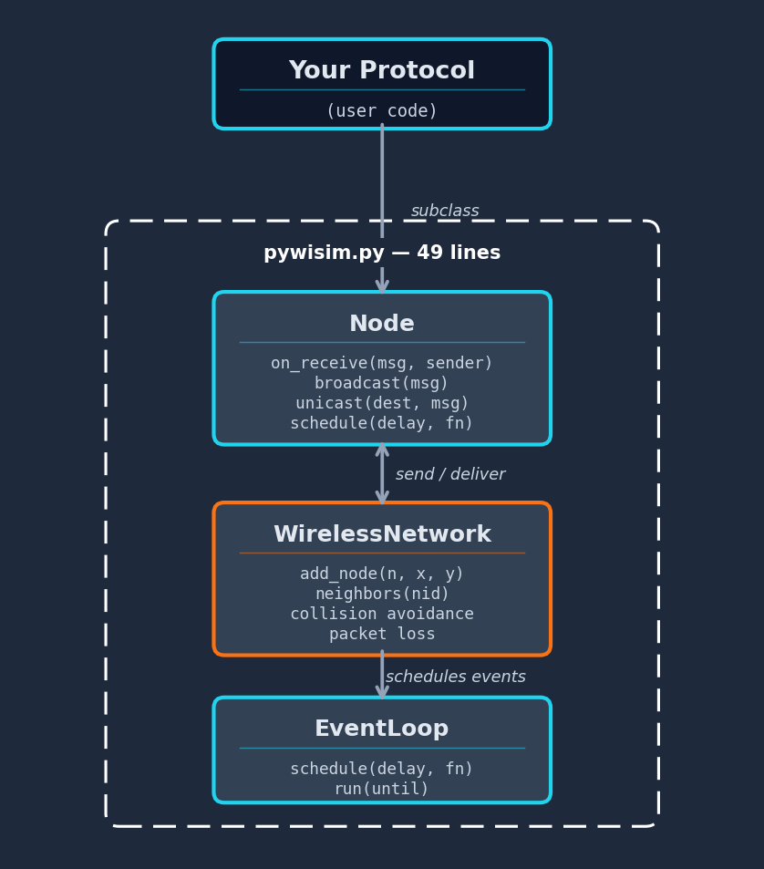
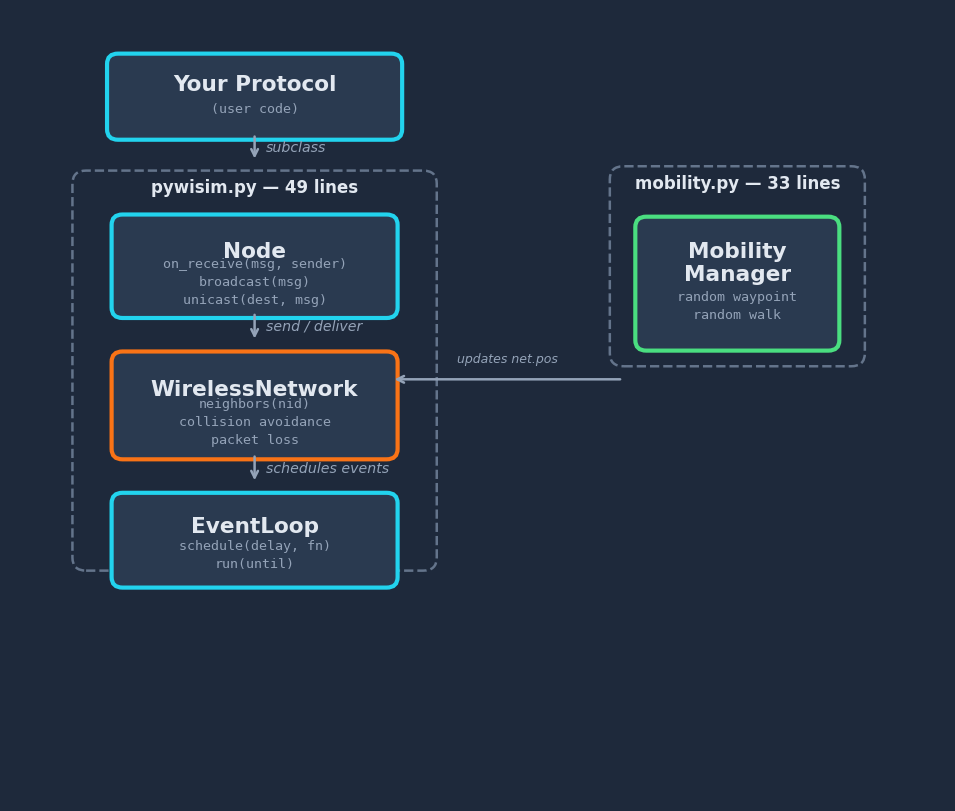
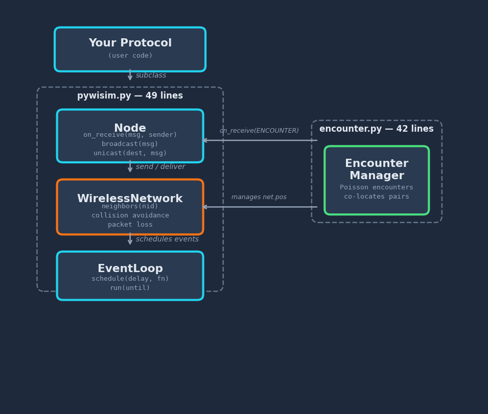

# PyWiSim

**A minimal wireless distributed protocol simulator in Python.**

The entire simulator is under 50 lines of Python.

No dependency hell. No XML configuration. No 200-page manual. Just subclass `Node`, override `on_receive`, and start building distributed protocols over a simulated wireless network.

## Overview

PyWiSim is a discrete-event wireless network simulator designed for teaching and rapid prototyping. While tools like ns-3 and OMNeT++ are powerful, their complexity can obscure the core ideas behind distributed protocols. PyWiSim strips away everything non-essential so you can focus on protocol logic.

The simulator provides:
- A realistic-enough wireless channel (transmission range, packet loss, carrier-sense collision avoidance)
- Broadcast and unicast primitives
- A discrete-event engine for scheduling

Two optional companion modules extend pywisim to mobile and intermittently connected networks — without touching the core:

- **`mobility.py`** (~33 lines) — moves nodes over time for MANET simulations
- **`encounter.py`** (~42 lines) — schedules random pairwise encounters for DTN/ICMN simulations

Protocols use the same `Node` API (`on_receive`, `broadcast`, `unicast`, `schedule`) across all three settings. Everything else — routing, consensus, epidemic forwarding — is your code.

## Architecture

<p align="center">
  
</p>

PyWiSim has three classes:

| Class | Role |
|-------|------|
| **`EventLoop`** | Priority-queue discrete-event scheduler. Drives simulation time forward. |
| **`Node`** | Base class for your protocol. Override `on_receive(msg, sender)` to define behavior. Call `broadcast()`, `unicast()`, and `schedule()` to act. |
| **`WirelessNetwork`** | Manages node positions, neighbor discovery, transmission simulation, carrier-sense collision avoidance, and distance-dependent packet loss. |

## Quick Start

```bash
git clone https://github.com/ANRGUSC/PyWiSim.git
cd PyWiSim
python examples/flooding.py
```

No dependencies beyond the Python standard library.

## How to Build Your Protocol

1. **Subclass `Node`** and override `on_receive(msg, sender)`
2. **Place nodes** in the network with `add_node(node, x, y)`
3. **Kick things off** by scheduling an initial action
4. **Run** the event loop

```python
from pywisim import EventLoop, Node, WirelessNetwork

class MyNode(Node):
    def on_receive(self, msg, sender):
        print(f"{self.nid} got {msg} from {sender}")
        # React: broadcast, unicast, schedule timers, etc.

loop = EventLoop()
net = WirelessNetwork(loop, tx_range=1.5)
for nid, x, y in [('A',0,0), ('B',1,0), ('C',2,0)]:
    net.add_node(MyNode(nid), x, y)

loop.schedule(1.0, net.nodes['A'].broadcast, ('HELLO',))
loop.run(until=10)
```

## Examples

All examples use a simple line or star topology and print step-by-step traces.

### Flooding (`examples/flooding.py` — 29 lines)

Reliable broadcast over a multi-hop network. Node A floods a message; each node rebroadcasts it once, ensuring delivery across the entire network even when nodes are out of direct range.

```
A --flood--> B --rebroadcast--> C --rebroadcast--> D --> E
```

Key idea: duplicate suppression via a `seen` set prevents infinite rebroadcast loops.

### Echo Algorithm (`examples/echo.py` — 52 lines)

Builds a spanning tree from an initiator node. The initiator sends EXPLORE messages outward; leaf nodes reply with ECHO. Each node waits for all echoes before forwarding upward, converging to a rooted tree.

Key idea: a node picks the first sender as its parent and counts echoes to know when its subtree is complete.

### AODV Routing (`examples/aodv.py` — 64 lines)

Reactive (on-demand) route discovery. Node A wants to reach Node E, so it floods a Route Request (RREQ). When E receives the RREQ, it unicasts a Route Reply (RREP) back along the reverse path, populating routing tables at each hop.

Key idea: sequence numbers prevent routing loops; hop counts select shortest paths.

### Consensus (`examples/consensus.py` — 40 lines)

Flood-and-majority consensus on a binary value. Each node proposes 0 or 1, floods its vote, collects all votes, and decides by majority. Demonstrates how even a simple protocol can achieve agreement in a connected network.

Key idea: all-to-all information dissemination via flooding, then local majority decision.

### Leader Election (`examples/leader_election.py` — 39 lines)

Each node picks a random value and announces it via flooding. Every node tracks the highest value seen. After convergence, the node holding the maximum value is the elected leader.

Key idea: distributed extrema-finding — every node independently converges to the same answer by keeping the max.

### Two-Phase Commit (`examples/two_phase_commit.py` — 48 lines)

Classic distributed transaction protocol adapted for wireless. A coordinator sends PREPARE to all participants, collects YES/NO votes, and broadcasts COMMIT or ABORT. Demonstrates coordinator-participant interaction using unicast.

Key idea: atomic commitment — if any participant votes NO, the entire transaction aborts.

---

## Mobile and Intermittently Connected Networks

The core simulator assumes a static topology. Two optional companion modules extend it to dynamic networks while preserving the same `Node` API — protocols are written with `on_receive`, `broadcast`, `unicast`, and `schedule` regardless of the network model.

<p align="center">
  
  &nbsp;&nbsp;
  
</p>

### Mobility: MANETs (`mobility.py`)

`MobilityManager` periodically updates node positions via the event loop. Since `neighbors()`, `dist()`, and the loss model all read positions dynamically, moving a node automatically changes its connectivity — no topology rebuild needed.

Two standard models are included:
- **Random Waypoint** — each node picks a random destination within bounds, moves toward it at constant speed, then picks a new destination on arrival.
- **Random Walk** — each node moves a fixed step in a random direction at each interval.

```python
from mobility import MobilityManager

mob = MobilityManager(net, interval=1.0, speed=0.5, bounds=(10, 10))
mob.start('waypoint')   # or 'walk'
```

#### Example: AODV over a MANET (`examples/aodv_mobility.py`)

Demonstrates reactive routing in a network where topology changes. Seven nodes move via random waypoint. The simulation runs in two phases:

1. **Phase 1** — nodes move for 5 seconds, mobility pauses. AODV discovers a route from A to G (e.g., A → B → F → G).
2. **Phase 2** — nodes move for another 15 seconds, topology reshuffles. AODV runs again and finds a completely different route (e.g., A → C → G).

The protocol code is identical to the static AODV example — only the network underneath has changed.

### Encounters: ICMNs / DTNs (`encounter.py`)

`EncounterManager` models intermittently connected mobile networks where nodes are typically out of range and only communicate during brief pairwise encounters. Behind the scenes, non-encountering nodes are kept far apart (no radio neighbors). When a pair encounters, both are co-located so that standard `unicast`/`broadcast` works through pywisim's normal `_send`/`_deliver` path. After the encounter window, positions are restored.

Encounters follow a Poisson process with a configurable rate.

```python
from encounter import EncounterManager

enc = EncounterManager(net, rate=1.5, duration=1.0)
enc.start()
```

#### Example: Epidemic Flooding over an ICMN (`examples/epidemic_icmn.py`)

Demonstrates store-and-forward epidemic dissemination across 8 nodes. Node A originates a file. Whenever two nodes encounter, each sends its buffered data to the other via `unicast` — pywisim delivers it losslessly. The file propagates hop by hop through chance encounters:

```
t=0.1  A originates file.pdf
t=0.7  A encounters F → F gets the file
t=2.9  E encounters G → G gets the file (via E, who got it from A earlier)
  ...
t=7.3  G encounters D → D gets the file (last node)
```

All 8 nodes eventually receive the file, with the propagation time depending on encounter patterns.

---

## Features

- **49 lines of simulator code** — read the whole thing in a few minutes
- **Optional mobility and encounter modules** — ~33 and ~42 lines respectively, for MANET and DTN simulations
- **Zero dependencies** — only Python standard library (`heapq`, `math`, `random`)
- **Discrete-event simulation** — priority queue drives time, no busy loops
- **Distance-based topology** — neighbors determined by Euclidean distance and transmission range
- **Carrier-sense collision avoidance** — nodes back off when the channel is busy
- **Distance-dependent packet loss** — farther nodes have higher loss probability
- **Seeded randomness** — reproducible results across runs
- **Broadcast and unicast** — two communication primitives, just like real wireless
- **Timer scheduling** — `schedule(delay, fn)` for timeouts, periodic tasks, etc.
- **Verbose timestamped logging** — trace every send and receive

## API Reference

### `EventLoop`
- `schedule(delay, fn, *args)` — schedule `fn(*args)` after `delay` time units
- `run(until=100)` — run the simulation until time `until`
- `time` — current simulation time

### `Node`
- `__init__(nid)` — create a node with identifier `nid`
- `on_receive(msg, sender)` — **override this** to define your protocol
- `broadcast(msg)` — send `msg` to all neighbors
- `unicast(dest, msg)` — send `msg` to a specific neighbor
- `schedule(delay, fn, *args)` — schedule a future action

### `WirelessNetwork`
- `__init__(loop, tx_range=1.6, loss=0.02, tx_time=0.5, seed=42, verbose=True)`
- `add_node(node, x, y)` — place a node at coordinates `(x, y)`
- `neighbors(nid)` — list of nodes within transmission range
- `log(msg)` — print timestamped message (if verbose)

### `MobilityManager` (`mobility.py`)
- `__init__(net, interval=1.0, speed=0.5, bounds=(10, 10))`
- `start(model='waypoint')` — begin moving nodes (`'waypoint'` or `'walk'`)
- `stop()` — pause movement

### `EncounterManager` (`encounter.py`)
- `__init__(net, rate=1.0, duration=1.0)` — Poisson encounter rate; duration of each encounter window
- `start()` — begin scheduling encounters
- `stop()` — stop scheduling encounters

## License

[PolyForm Noncommercial 1.0.0](LICENSE)

## Author

Bhaskar Krishnamachari, USC — built with [Claude Code](https://claude.ai/code)
